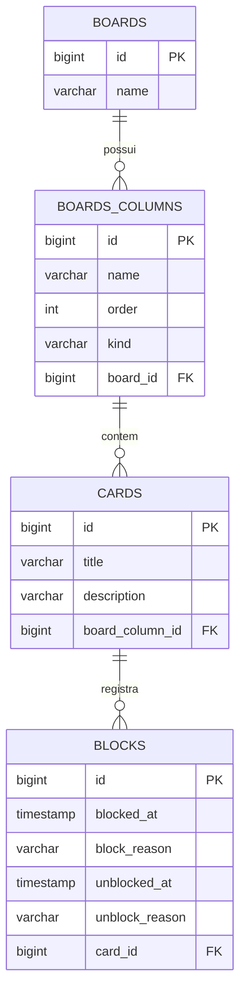

# 📋 Kanban Board CLI — Java, JDBC & Liquibase


---

## 🔗 Ambiente de Execução e Banco de Dados

* **Interface:** Terminal Interativo de Linha de Comando (CLI)
* **Banco de Dados:** MySQL 8.0 (Database: `board`, Usuário padrão: `board`, Senha: `board`)
* **Migrações:** Executadas de forma automatizada no startup da aplicação via **Liquibase**

---

## 📖 Visão Geral

O **Kanban Board CLI** é uma aplicação desktop/terminal desenvolvida em **Java 17+** com gerenciamento de build em **Gradle (Kotlin DSL)**, concebida como projeto prático avaliativo da plataforma **Digital Innovation One (DIO)**.

A aplicação implementa um sistema completo de gerenciamento ágil de tarefas no formato **Kanban**, operando diretamente sobre o banco relacional MySQL através de **JDBC nativo** com o padrão **Data Access Object (DAO)**. O projeto destaca-se por não utilizar ORMs de alto nível, demonstrando controle granular sobre transações SQL manuais (`autoCommit = false`), versionamento de schema com **Liquibase** e tratamento estrito de regras de negócio para movimentação, bloqueio e auditoria de cartões.

---

## ✨ Funcionalidades

* 📌 **Gerenciamento de Quadros (Boards):**
  * Criação de novos quadros com colunas padrão automáticas (*Inicial*, *Pendente*, *Final* e *Cancelamento*) e opção de incluir colunas intermediárias customizadas.
  * Seleção de quadros existentes para gerenciamento operacional.
  * Exclusão de quadros com remoção em cascata dos cartões e histórico.
* 📝 **Ciclo de Vida de Cartões (Cards):**
  * Criação de tarefas com título e descrição alocadas na coluna inicial.
  * Movimentação progressiva entre colunas sequenciais.
  * Cancelamento imediato de tarefas em qualquer estágio do fluxo.
* 🚫 **Sistema de Bloqueio e Desbloqueio com Auditoria:**
  * Bloqueio de cartões impedindo movimentações futuras enquanto pendências existirem, registrando timestamp UTC e justificativa (`block_reason`).
  * Desbloqueio auditado com arquivamento da razão do desbloqueio (`unblock_reason`) e timestamp de liberação.
* 📊 **Visualização do Quadro:** Exibição estruturada no terminal de todas as colunas do board com contagem e detalhes dos cards associados.

---

## 🎯 Diferenciais e Destaques Técnicos

1. **Migrações Automatizadas no Startup com Liquibase:** A classe `MigrationStrategy` intercepta a inicialização no método `main`, aplicando changelogs SQL versionados antes de liberar o menu interativo:
   ```java
   try (var connection = getConnection()) {
       new MigrationStrategy(connection).executeMigration();
   }
   ```
2. **Controle Transacional Rigoroso com JDBC:** Conexões configuradas com `connection.setAutoCommit(false)`, assegurando atomicidade e rollback automático em cenários de falha.
3. **Domínio Rico com Exceções Customizadas:** Lógica de negócio protegida por regras semânticas específicas:
   * `CardBlockedException`: Lançada ao tentar mover um cartão em estado de bloqueio.
   * `CardFinishedException`: Lançada ao tentar alterar um cartão já concluído na coluna final.
   * `EntityNotFoundException`: Tratamento seguro para identificadores inexistentes.
4. **Padronização Temporal com UTC:** Conversor `OffsetDateTimeConverter` garantindo que todos os timestamps de auditoria de bloqueio e criação sejam persistidos com precisão e independência de fuso horário local.

---

## 🏗️ Arquitetura e Estrutura de Pastas

```text
src/main/
├── java/br/com/dio/
│   ├── dto/                    # Data Transfer Objects (Java Records imutáveis)
│   │   ├── BoardColumnDTO.java
│   │   ├── BoardColumnInfoDTO.java
│   │   ├── BoardDetailsDTO.java
│   │   └── CardDetailsDTO.java
│   ├── exception/              # Exceções customizadas de domínio
│   │   ├── CardBlockedException.java
│   │   ├── CardFinishedException.java
│   │   └── EntityNotFoundException.java
│   ├── persistence/            # Camada de Persistência e Acesso a Dados
│   │   ├── config/             # Configuração da conexão JDBC (ConnectionConfig)
│   │   ├── converter/          # Conversores de tipo (OffsetDateTime <-> Timestamp)
│   │   ├── dao/                # Objetos de acesso a dados (BoardDAO, CardDAO, BlockDAO)
│   │   ├── entity/             # Entidades de mapeamento e Enums (BoardColumnKindEnum)
│   │   └── migration/          # Estratégia de execução do Liquibase
│   ├── service/                # Serviços de regras de negócio e consultas
│   │   ├── BoardService.java
│   │   ├── BoardQueryService.java
│   │   ├── CardService.java
│   │   └── CardQueryService.java
│   ├── ui/                     # Interface de usuário baseada em terminal (CLI)
│   │   ├── MainMenu.java       # Menu raiz do sistema
│   │   └── BoardMenu.java      # Menu de operações do quadro selecionado
│   └── Main.java               # Classe de entrada principal do programa
└── resources/
    ├── db/changelog/           # Scripts SQL versionados do Liquibase
    └── liquibase.properties    # Propriedades de configuração do changelog
```

---

## 🎲 Modelagem do Banco de Dados (DER)



---

## 🧭 Fluxo de Navegação do Terminal (CLI)

```text
               +-----------------------------+
               |      Menu Principal         |
               | 1. Criar novo quadro        |
               | 2. Selecionar quadro        |
               | 3. Excluir quadro           |
               | 4. Sair                     |
               +-----------------------------+
                              | (Selecionar quadro)
                              v
               +-----------------------------+
               |       Menu do Quadro        |
               | 1. Criar cartão             |
               | 2. Mover cartão             |
               | 3. Bloquear cartão          |
               | 4. Desbloquear cartão       |
               | 5. Cancelar cartão          |
               | 6. Visualizar quadro        |
               | 7. Detalhes do cartão       |
               | 8. Voltar ao menu inicial   |
               +-----------------------------+
```

---

## ⚙️ Requisitos e Instalação

### Pré-requisitos
* **Java Development Kit (JDK):** Versão 17 ou superior instalada e configurada no `JAVA_HOME`.
* **Banco de Dados MySQL:** Servidor MySQL 8.0 rodando localmente ou via container.

### 1. Clonar o Repositório
```bash
git clone https://github.com/erickystn/board_java_Dio.git
cd board_java_Dio
```

### 2. Configurar o Banco de Dados no MySQL
Conecte-se ao seu MySQL e crie o banco de dados e as credenciais padrão:
```sql
CREATE DATABASE board;
CREATE USER 'board'@'localhost' IDENTIFIED BY 'board';
GRANT ALL PRIVILEGES ON board.* TO 'board'@'localhost';
FLUSH PRIVILEGES;
```
*(Caso queira utilizar outros dados de acesso, ajuste as constantes em `src/main/java/br/com/dio/persistence/config/ConnectionConfig.java`).*

---

## 🚀 Como Executar

Utilizando o Gradle Wrapper incluso no projeto:

```bash
# No Linux / macOS:
./gradlew run

# No Windows:
gradlew.bat run
```

Ao iniciar, o Liquibase aplicará todas as migrações automaticamente no banco de dados e apresentará o menu inicial de opções.

---

## 🛠️ Tecnologias Utilizadas

| Tecnologia | Versão | Finalidade |
| :--- | :--- | :--- |
| **Java** | 17 | Linguagem base da aplicação |
| **Gradle** | 8.8 | Ferramenta de automação de build e gerenciamento de dependências |
| **MySQL Connector/J** | 8.0.33 | Driver de conectividade JDBC para MySQL |
| **Liquibase Core** | 4.29.1 | Gerenciamento e versionamento evolutivo do esquema SQL |
| **Lombok** | 1.18.34 | Redução de boilerplate (Getters, Setters, Construtores) |

---

## 👤 Autor & 📄 Licença

Desenvolvido por **[Ericky Sant'ana](https://github.com/erickystn)** como Desafio de Projeto da **Digital Innovation One (DIO)**.

Distribuído sob a licença **MIT**.
